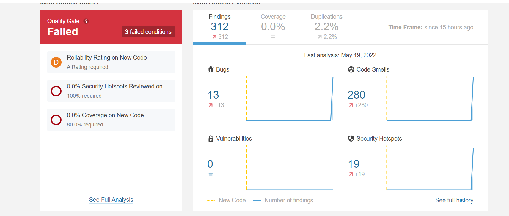

# Manuális kód átvizsgálás elvégzése az alkalmazás egy részére + Statikus analízis eszköz futtatása és jelzett hibák átnézése

Az alkalmazás osztályait vizsgáltam meg SonarLint segítségével, a Code Smelleket detektáltam és a nagyobb hibákat a SonarLint javaslatai alapján javítottam.

## Minor code smellek:

- A kód egészében nem a megfelelő java által előírt szabványos szintaktikát használjuk, miszerint pl. decreaseLayer() lenne egy függvény neve, nem DecreaseLayer()
- A package neveknél se a megfelelő szabványos szintaktikát használjuk
- List helyett ArrayListet használunk, ami nem Java.Collection packageből származik
- Változók deklarálása külön sorba legyen
- Booleanek helyébe ifeknél nem kell az == true
- Absztrakt osztály, helyett lehetne Interface is az egyik osztályunk

## Critical code smellek:

A dokumentálás további részében a kritikus code smelleket említem és ezekre javaslok javításokat. Végig néztem az összes osztályt, de nem minden code smellt csak egyszer említenék.

### Main.java

- Code Smell: A Random objektumok külön-külön függvénybe vannak létrehozva, ahelyett hogy egyszer az osztályba létre lenne hozva.
Javítás: Statikus random objektum létrehozása

- Code Smell: Statikus változó értékének változtatása nem statikus függvényből
Javítás: Függvény statikussá tétele

- Code Smell: Generikus HashMap létrehozásnál adjuk meg a típust is az értékadásnál is
Javítás: private static HashMap<String, Object> hash = new HashMap<String,Object>();

### Asteroid.java

- Code Smell: Hiánzyik az if statement után a zárójel, így nem mindenki számára egyértelmű, hogy pontosan mire vonatkozik az if
Javítás: {} használata

### ControlPanel.java

- Code Smell: Nem használt tagváltozók benne maradtak a kódban.
Javítás: Kitörölni ezeket

- Code Smell: Nem mentjük el változóba egy objektumon meghívottt függvény értékét.
Javítás: Mentsük el új változóba.

### GAsteroid.java

- Code Smell: Két ugyanolyan nevű változó van, az egyik az osztály tagváltozója, a másik egy tagfüggvényben van létrehozva feleslegesen.
Javítás: Egyik változó törlése

### Material.java

- Code Smell: Az egyik függvény csak egy nagybetűben tér el az egyik beépített függvénytől
Javítás: Nevezzük át a függvényt.

### Space.java

- Code Smell: Kódsorok vannak kikommentezve
Javítás: Töröljük ki ezeket a sorokat.

### Transport.java

- Code Smell: Egyik függvény neve ugyanaz, mint az osztály neve
Javítás: Módosítsuk a függvény nevét

### Ufo.java

- Code Smell: Üres függvényhez, nincs odaírva semmi komment, hogy miért üres
Javítás: A függvény törzsébe oda lehetne írni, hogy miért nem csinál semmit a függvény

Miután átvizsgáltam manuálisan a kódot, összekötöttem a GitHubot a SonarClouddal. Ehhez létre kellett hozni a projekthez pom.xml-t és maven.yaml fájlt.

A képen látható, hogy 13 bug, 280 code smell és 19 security hotspot van a kódban. 
SonarCloud segítségével is böngésztem a code smelleket, ami másokat is jelzett, a Sonarlinten kívül. Itt 4 csoportba osztotta őket, Blocker, Critical, Major és Minor hibákat jelzett.

